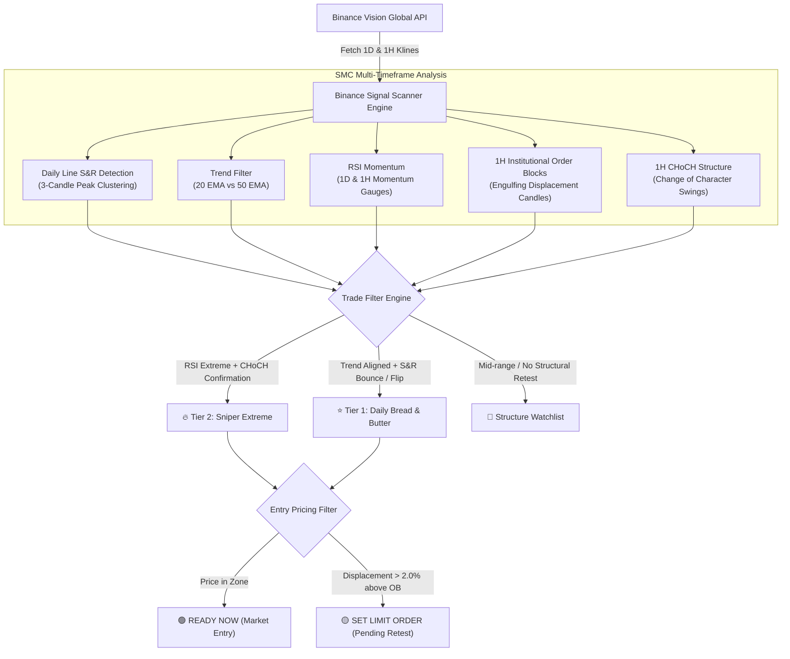
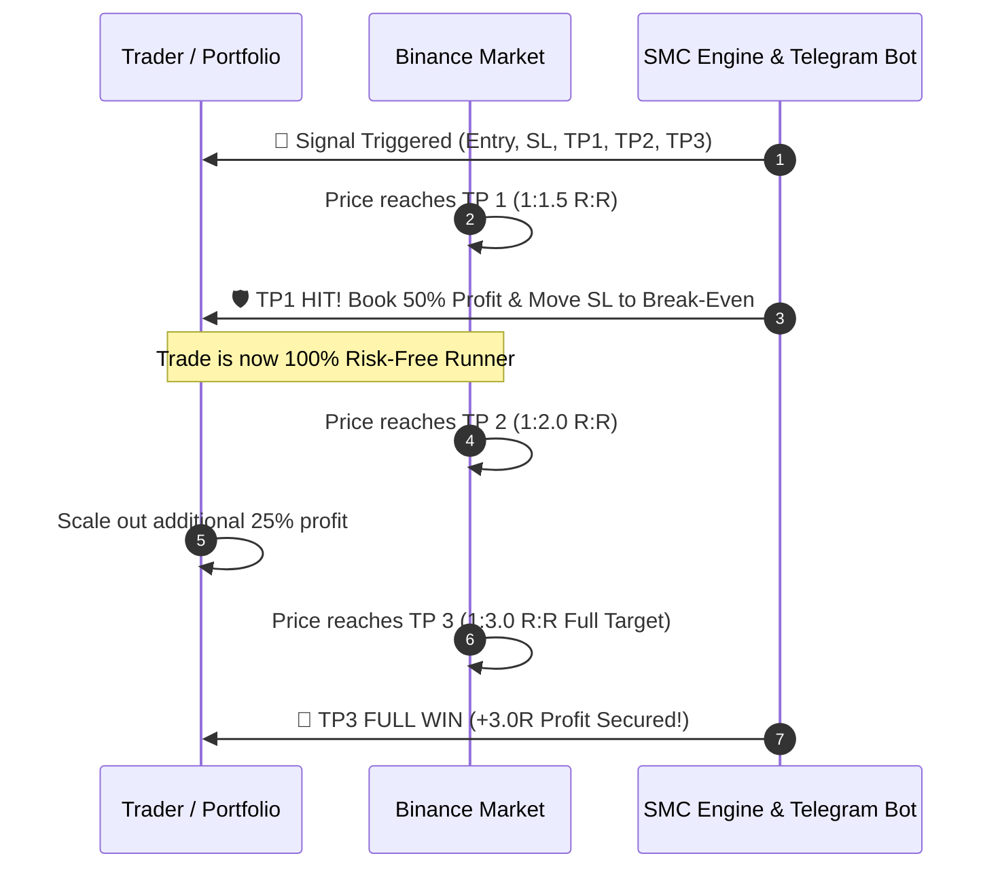
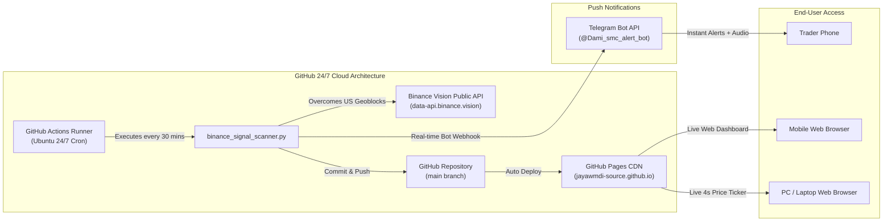
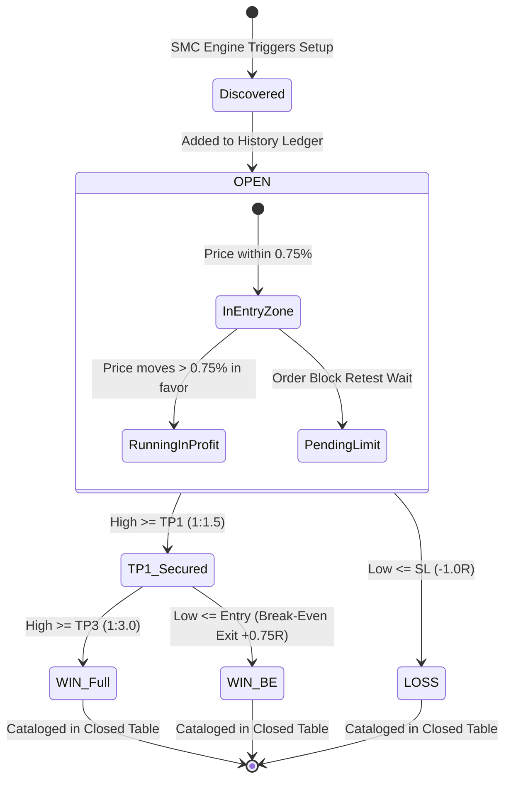

# Comprehensive Technical & Strategic Report: Binance Hybrid SMC Automated Trading System & 24/7 Cloud Architecture

---

## 1. Executive Summary

The **Binance Hybrid Smart Money Concepts (SMC) Automated Trading System** is an end-to-end algorithmic market intelligence and automated signal distribution ecosystem. Developed specifically for high-volatility cryptocurrency markets on Binance, the system continuously analyzes high-timeframe institutional price action, filters out retail market noise, and broadcasts high-probability swing and intraday setups with an asymmetric **1:3 Risk-to-Reward (R:R)** profile.

Unlike conventional indicators that lag market price action or suffer from curve-fitted signals, this architecture synthesizes:
1. **Institutional Market Structure** (Daily Line Support & Resistance, 1-Hour Institutional Order Blocks, S/R Flips, and Change of Character [CHoCH] confirmations).
2. **Dual-Tier Risk Classification** (Tier 1 Daily Structural Bounces and Tier 2 Sniper Extreme Reversals).
3. **Execution Clarity** (Segregating immediate entry opportunities from optimal pending limit retests).
4. **Dynamic Scaled Exits (Multi-TP)** (Locking in 50% profit at TP1 and moving Stop Loss to Break-Even for zero-risk continuation).
5. **24/7 Autonomous Cloud Execution** (Serverless scheduled pipeline via GitHub Actions, global CDN web hosting via GitHub Pages, and real-time mobile push notifications via Telegram Bot API).

---

## 2. Core Philosophy & The Mathematical Edge

### 2.1 The Asymmetric Risk-to-Reward Engine (1:3 Minimum R:R)
Most retail traders fail due to an inverted risk profile (risking $2.00 to make $1.00), which demands an unsustainably high win rate (>70%) to maintain profitability. The developed SMC engine strictly enforces a minimum **1:3 Risk-to-Reward ratio** on every initiated setup.

$$\text{Break-Even Win Rate} = \frac{\text{Risk}}{\text{Risk} + \text{Reward}} = \frac{1}{1 + 3} = 25.0\%$$

```
   ┌─────────────────────────────────────────────────────────────┐
   │                  MATHEMATICAL EDGE PROFILE                   │
   ├──────────────────┬────────────────────────┬─────────────────┤
   │ Win Rate Metric  │ Outcome Breakdown      │ Net PnL (in R)  │
   ├──────────────────┼────────────────────────┼─────────────────┤
   │ 30% Win Rate     │ 3 Wins (+9R), 7 Losses │ +2.0 R Profit   │
   │ 40% Win Rate     │ 4 Wins (+12R), 6 Losses│ +6.0 R Profit   │
   │ 50% Win Rate     │ 5 Wins (+15R), 5 Losses│ +10.0 R Profit  │
   └──────────────────┴────────────────────────┴─────────────────┘
```

Even with an adverse market streak resulting in a 70% loss rate, a modest 30% win rate yields a positive net return of $+2.0R$.

### 2.2 Structural Stop Loss Protection
Stop losses are never arbitrary fixed percentages. They are anchored strictly behind major market structure:
- **For Longs:** Safe buffer placed **1.5% below** the 1-Hour Bullish Order Block bottom or Daily Line Support.
- **For Shorts:** Safe buffer placed **1.5% above** the 1-Hour Bearish Order Block top or Daily Line Resistance.

This structural placement prevents "wick-outs" caused by exchange liquidity sweeps while preserving tight, calculated risk.

---

## 3. Algorithmic Trading Architecture & Signal Logic



### 3.1 Tier 1: Daily Institutional Setups
- **Trend Alignment:** 20 EMA > 50 EMA for Longs; 20 EMA < 50 EMA for Shorts.
- **Key Level Interaction:** Price within $\le 3.5\%$ of Daily Line Support or a confirmed S/R Flip breakout level.
- **Demand/Supply Confluence:** Presence of an unmitigated 1-Hour Order Block acting as high-probability entry support.
- **RSI Health:** Daily RSI bounded between $38 \le \text{RSI} \le 68$ (healthy trend continuation, avoiding exhaustion zones).

### 3.2 Tier 2: Sniper Extreme Reversals
- **Parabolic Exhaustion:** Daily RSI $\ge 78.0$ or 1H RSI $\ge 80.0$ (Overbought) / Daily RSI $\le 22.0$ or 1H RSI $\le 20.0$ (Oversold).
- **CHoCH (Change of Character) Mandatory Rule:** Protects against catching falling knives or counter-trading runaway bull runs. The system requires a candle close breaking the prior 1H swing structure before issuing a reversal alert.

### 3.3 Scaled Multi-TP Take-Profit Framework



1. **TP 1 (1:1.5 R:R):** 50% position closed. Stop Loss immediately adjusted to **Break-Even ($0.00 Risk)**. The trade cannot lose money from this point forward.
2. **TP 2 (1:2.0 R:R):** Additional 25% scaled out.
3. **TP 3 (1:3.0 R:R):** Final 25% runner target achieved.

---

## 4. Operational Classification: Eliminating Trader Confusion

A frequent failure of signal tools is ambiguity: *Should I buy right now at market, or wait?* The developed system solves this via explicit real-time tagging across all platforms:

| Classification | Meaning | Action Recommended |
|---|---|---|
| **🟢 READY NOW (Ganna Puluwan)** | Price is currently within $\pm 0.75\%$ of the structural entry zone. | Execute an immediate Market Buy/Sell order. |
| **🟡 PENDING LIMIT ORDER** | Price expanded rapidly away from the 1H Order Block ($\ge 2.0\%$ distance). | Place a Binance Limit Order at the 1H OB retest level and wait for the pullback. |
| **🚀 RUNNING IN PROFIT** | The trade has rallied into positive territory ($> 0.75\%$ profit or TP1 hit). | **Do Not Chase.** Existing holders trail stops; new buyers avoid entering late. |
| **🛑 EXPIRED / CLOSED** | Stop Loss or Final 1:3 Take Profit target touched. | Trade resolved and cataloged into historical ledger. |

---

## 5. 24/7 Serverless Cloud Architecture



### 5.1 Global Cloud Resilience & Binance Vision API
Default Binance API endpoints (`api.binance.com`) reject or rate-limit US-based IP addresses, causing standard cloud runners (e.g., GitHub Actions hosted on Azure in `westus2`) to return 0 market pairs. 
- **The Solution:** Implemented official Binance public cluster priority:
  1. `https://data-api.binance.vision/api/v3` (Global non-restricted public market data)
  2. `https://api.binance.com/api/v3`
  3. `https://api1.binance.com/api/v3` through `api3.binance.com`
- **Network Guard:** Zero-byte network fallbacks prevent accidental corruption of historical records during exchange downtimes.

### 5.2 Real-Time Client-Side Price Polling (4-Second Stream)
To ensure the user never relies on stale snapshot data between the 30-minute cloud cycles:
- The dashboard embeds a lightweight vanilla JavaScript asynchronous polling worker.
- Every **4 seconds**, it queries Binance ticker prices directly from the browser.
- Floating profit/loss percentages, live price values, and status badges recalculate dynamically in real time without refreshing the webpage.

### 5.3 Cache-Busting Protocol
To ensure that mobile browsers never serve stale cached HTML:
- The HTML generator embeds strict HTTP-equiv headers:
  ```html
  <meta http-equiv="Cache-Control" content="no-cache, no-store, must-revalidate">
  <meta http-equiv="Pragma" content="no-cache">
  <meta http-equiv="Expires" content="0">
  ```
- Any browser navigating to the GitHub Pages URL instantly fetches the freshest state.

---

## 6. Real-Time Telegram Alert System

Configured with Telegram Bot `@Dami_smc_alert_bot` (Chat ID: `5448711923`), the system dispatches push notifications directly to the user's mobile device:

### 6.1 Event Triggers
1. **New Signal Generated:** Dispatches market or limit parameters, structural Stop Loss, 3 target levels, RSI data, and Order Block details.
2. **TP1 Secured (1:1.5):** Prompts the trader to book 50% profit and slide SL to Break-Even.
3. **Full TP3 Won (1:3.0):** Celebrates a $+3.0R$ trade completion.
4. **SL Hit:** Automatically books the $-1.0R$ loss and logs the closed status.

### 6.2 Instant Action Links
Every message includes direct deep-links:
- `Trade on Binance`: Opens the exact spot trading pair on Binance.
- `Open Live SMC Dashboard`: One-tap direct access to the live GitHub Pages dashboard.

---

## 7. State Machine & Trade Persistence

The trade lifecycle is recorded in `trade_history.json`:



### 7.1 Anchor Entry Principle
Once a trade is marked `OPEN`, its baseline parameters (Entry, SL, TP1, TP2, TP3) are **frozen permanently**. Even as prices rally, the scanner anchors the original trade parameters to calculate true cumulative PnL, preventing shifting targets.

---

## 8. Verified System Performance (Current Live Status)

As of latest execution:
- **Total Tracked Pairs:** 35 High-Liquidity USDT Pairs
- **Active Trade Positions:** 17 Signals Open & Monitored
  - **Running In Profit:** 11 pairs (e.g., SOLUSDT $+4.01\%$, BTCUSDT $+4.17\%$, FILUSDT $+5.40\%$, TAOUSDT $+4.17\%$, XRPUSDT $+3.40\%$, ADAUSDT $+3.67\%$).
  - **TP1 Hit / BE Secured:** 2 pairs (AAVEUSDT $+6.42\%$, SHIBUSDT $+3.79\%$).
  - **Ready Now (In Zone):** 3 pairs (FTMUSDT, GALAUSDT, SANDUSDT).
  - **Pending Limit Setups:** 6 pairs (e.g., DOGEUSDT limit retest $@ \$0.087560$).
- **Live URLs:**
  - **Web Dashboard:** [https://jayawmdi-source.github.io/Crypto_Signals/](https://jayawmdi-source.github.io/Crypto_Signals/)
  - **Local Host:** [http://localhost/crypto/dashboard.html](http://localhost/crypto/dashboard.html)
  - **Telegram Bot:** `@Dami_smc_alert_bot`

---

## 9. Conclusion & Strategic Value

The developed platform elevates trading from emotional guesswork to a structured, disciplined, institutional-grade workflow. By automating:
1. Multi-timeframe Smart Money market analysis,
2. Mathematical 1:3 R:R trade enforcement,
3. Real-time multi-platform status synchronization, and
4. 24/7 cloud reliability without recurring server bills,

the system provides an asymmetric advantage, allowing the trader to navigate the crypto markets with clarity, zero missed setups, and capital protection.
