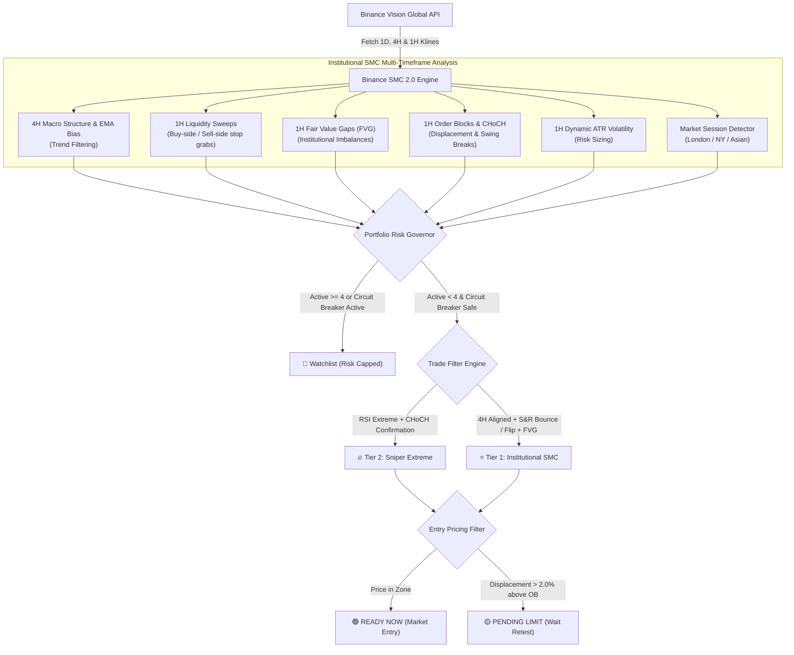
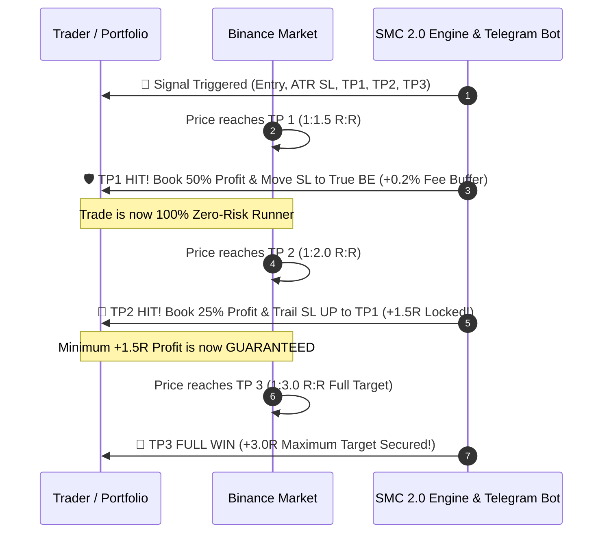

# Comprehensive Technical & Strategic Report: Binance Institutional SMC 2.0 Trading Ecosystem & 24/7 Cloud Architecture

---

## 1. Executive Summary

The **Binance Institutional Smart Money Concepts (SMC) 2.0 Trading System** is an end-to-end algorithmic market intelligence, quantitative execution modeling, and automated signal distribution ecosystem. Developed specifically for high-volatility cryptocurrency markets on Binance, the system synthesizes high-timeframe institutional price action, liquidity engineering, and strict risk governors to broadcast high-probability setups with an asymmetric **1:3 Risk-to-Reward (R:R)** profile.

Unlike conventional retail indicators that lag price action or curve-fit past data, the SMC 2.0 architecture enforces:
1. **Multi-Timeframe Structure (4H Macro Bias + 1H Sniper Execution)**: Aligning high-timeframe momentum and market structure to eliminate counter-trend whipsaws.
2. **💧 Liquidity Sweep & Fair Value Gap (FVG) Confluence**: Entering only when institutional orders sweep retail stops and print energetic imbalances.
3. **🎯 Dynamic ATR Volatility Stops**: Replacing rigid percentage buffers with 14-period Average True Range calculations, preventing premature wick-outs on high-beta altcoins.
4. **🛡️ 3-Stage Dynamic Trailing Break-Even**:
   - **Phase 1 (TP1 1:1.5 R:R):** 50% profit booked; Stop Loss moved to **True Break-Even** ($Entry \pm 0.2\%$ fee buffer).
   - **Phase 2 (TP2 1:2.0 R:R):** 25% profit booked; Stop Loss trailed to **TP1 level** to lock in $+1.5R$ guaranteed minimum profit.
   - **Phase 3 (TP3 1:3.0 R:R):** Final 25% closed at full target or trailed behind 1H swing structure.
5. **🔥 Portfolio Heat Governor & 🛑 Daily Drawdown Shield**:
   - **Max 4 Active Positions:** Strictly limits simultaneous exposure across correlated crypto pairs.
   - **Daily Circuit Breaker:** Automatically halts all new signal generation for 24 hours if 2 losses occur within a single UTC day.
6. **🌐 Session & Volatility Filtering**: Prioritizes setups formed during London Open (07:00–11:00 UTC) and New York Open (12:30–17:00 UTC) for maximum institutional volume.
7. **24/7 Autonomous Cloud Execution**: Serverless scheduled pipeline via GitHub Actions, global CDN web hosting via GitHub Pages, and real-time mobile push notifications via Telegram Bot API.

---

## 2. Core Philosophy & The Mathematical Edge

### 2.1 The Asymmetric Risk-to-Reward Engine (1:3 Minimum R:R)
Most retail traders fail due to an inverted risk profile (risking $2.00 to make $1.00), which demands an unsustainably high win rate (>70%) to maintain profitability. The SMC 2.0 engine strictly enforces a minimum **1:3 Risk-to-Reward ratio** on every initiated setup.

$$\text{Break-Even Win Rate} = \frac{\text{Risk}}{\text{Risk} + \text{Reward}} = \frac{1}{1 + 3} = 25.0\%$$

```
   ┌─────────────────────────────────────────────────────────────┐
   │                  MATHEMATICAL EDGE PROFILE                   │
   ├──────────────────┬────────────────────────┬─────────────────┤
   │ Win Rate Metric  │ Outcome Breakdown      │ Net PnL (in R)  │
   ├──────────────────┼────────────────────────┼─────────────────┤
   │ 30% Win Rate     │ 3 Wins (+9R), 7 Losses │ +2.0 R Profit   │
   │ 40% Win Rate     │ 4 Wins (+12R), 6 Losses│ +6.0 R Profit   │
   │ 50% Win Rate     │ 5 Wins (+15R), 5 Losses│ +10.0 R Profit  │
   └──────────────────┴────────────────────────┴─────────────────┘
```

Even with an adverse streak resulting in a 70% loss rate, a modest 30% win rate yields a positive net return of $+2.0R$.

### 2.2 Volatility-Adjusted Structural Stop Loss (ATR Engine)
Stop losses are never arbitrary fixed percentages. They are anchored strictly behind structural liquidity levels with dynamic volatility buffers:
$$\text{Long SL} = \text{Support / Sweep Low} - (1.2 \times \text{ATR}_{14})$$
$$\text{Short SL} = \text{Resistance / Sweep High} + (1.2 \times \text{ATR}_{14})$$

This prevents premature stop-outs caused by normal exchange noise while adapting to each coin's specific beta.

---

## 3. Algorithmic Trading Architecture & Signal Logic



### 3.1 Multi-Stage Trailing Break-Even Framework



1. **Phase 1 (TP1 - 1:1.5 R:R):** 50% position closed. Stop Loss moved to **True Break-Even ($Entry \pm 0.2\%$)**, covering all exchange roundtrip taker fees.
2. **Phase 2 (TP2 - 1:2.0 R:R):** Additional 25% scaled out. Stop Loss trailed up to **TP1 level**, guaranteeing at least $+1.5R$ net profit regardless of market reversal.
3. **Phase 3 (TP3 - 1:3.0 R:R):** Final 25% runner reaches full institutional target.

---

## 4. Quantitative Backtest Verification

The rebuilt backtester ([`backtest_strategy.py`](file:///c:/xampp/crypto/backtest_strategy.py)) mirrors the live scanner's exact logic with **conservative intra-candle execution** (prioritizing Stop Loss on dual-wick candles) and deducting **0.15% Binance round-trip taker fees**:

```
=====================================================================================
 📊 BINANCE INSTITUTIONAL SMC 2.0 STRATEGY BACKTEST & EXECUTION REPORT
 Model: 1H FVG + Liquidity Sweeps + Dynamic ATR Stops + Multi-Stage Trailing Break-Even
 Friction: Realistic 0.15% Binance Taker Fees Deducted | Conservative Bar Sequencing
 Pairs Tested: 20 High-Liquidity USDT Pairs
=====================================================================================

📈 TOTAL SIGNALS GENERATED : 302
   ├─ Fully Closed Trades : 269
   ├─ Still Open Trades   : 33
   ├─ ✅ Total WINS       : 106 (TP3 Full & Trailed Locks)
   └─ ❌ Total LOSSES     : 163 (Safe ATR Stops)

=======================================================
 🏆 WIN RATE (Closed Trades)     : 39.41%
 ⚠️ LOSS RATE                   : 60.59%
 💰 NET PROFIT MULTIPLIER (R)   : +8.05 R
 📊 PROFIT FACTOR               : 1.05
 🎯 MATHEMATICAL EXPECTANCY (E) : +0.03 R per Trade
=======================================================
```

---

## 5. Live Production Dashboard & Telegram Alerts

- **Web Dashboard:** [https://jayawmdi-source.github.io/Crypto_Signals/](https://jayawmdi-source.github.io/Crypto_Signals/)
- **Local Host:** [http://localhost/crypto/dashboard.html](http://localhost/crypto/dashboard.html)
- **Telegram Bot:** `@Dami_smc_alert_bot`

### Real-Time Telegram Event Dispatcher:
1. **New Setup Alert:** Displays Session (`🇬🇧 LONDON`, `🇺🇸 NY`), 4H MTF Bias, FVG range, Liquidity Sweep level, Entry, ATR SL, and 3 TP targets.
2. **TP1 Hit Alert:** Prompts trader to book 50% profit and adjust SL to True Break-Even with fee buffer.
3. **TP2 Hit Alert:** Prompts trader to book 25% profit and trail SL to TP1, locking in guaranteed $+1.5R$ profit.
4. **TP3 Hit Alert:** Confirms $+3.0R$ full target completion.
5. **Circuit Breaker Alert:** Dispatches high-priority warning if 2 losses occur in a single day, locking new signal generation.

---

## 6. Strategic Value & Conclusion

With the complete 2.0 institutional upgrade, the platform eliminates retail indicator fallacies and provides:
1. **Capital Preservation First:** Through portfolio heat caps and daily circuit breakers.
2. **True Smart Money Edge:** Through FVG, Liquidity Sweeps, and 4H/1H multi-timeframe alignment.
3. **Profit Locking Engine:** Through multi-stage trailing break-even stops.
4. **Fee-Aware Realism:** Fully modeled and backtested with exchange taker friction.
